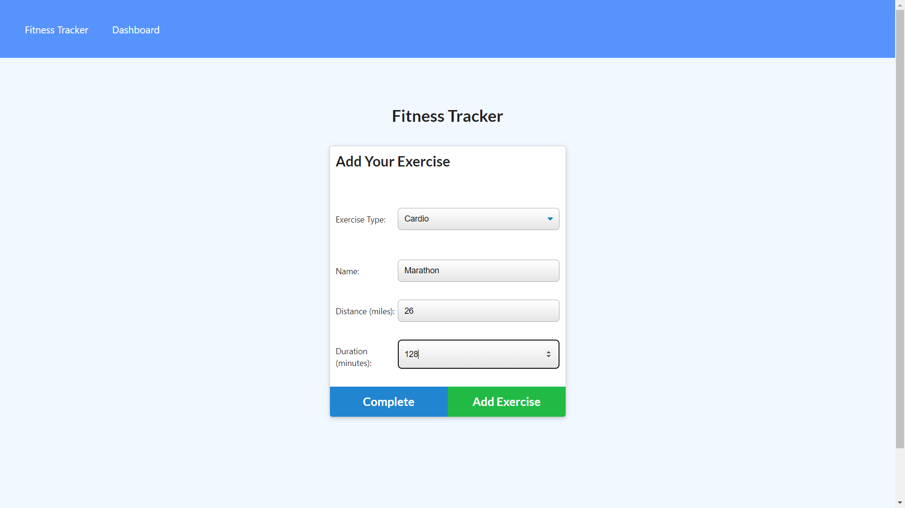

# HW18_WorkoutTracker

---

## INSTRUCTIONS
This project was assigned to allow the developer to be exposed to working with MongoDB and designing a mongo schema for the back end of the application. 
## Table of Contents
* [Installation:](#installation)
* [Usage:](#usage)
* [License:](#license)
* [Contribution:](#contributing)
* [Testing:](#tests)
* [Questions?](#questions)

## Installation
To install this app so that it functions properly, clone my github repository, open the integrated terminal tied to the current project folder, then run 'npm install' in your terminal. This should download all necessary packages.

## Usage
You can use this project to allow users to track their workout progress. When visiting the website, you will be greeted with an interface that allows you to create a new workout. You can name you workout as well as fill out the fine details in relation to the workout. The project also offers a dashboard where the user can track their progression.
## Example
Here you can see some examples of the deployed website: (https://polar-springs-95091.herokuapp.com/?id=61f5fc72979955001698f63c)

 # License
            This project is licensed under the MIT license (https://opensource.org/licenses/MIT)
            

## Contributing
Users can contribute to this project by examining the code to implement cool features such as a profile interface that allows you to save your workouts or perhaps upload videos that demonstrate techniques to execute certain workouts. That being said, creating a page of the most popular workouts, dissecting which muscle groups people want to work on and maybe even a page for diet plans! There are many cool features that can be added to this application

## Tests
This project can be tested by installing the necessary packages then run the program on your local environment which can be done via your intergrated terminal or tools alike such as gitbash or windows powershell.

You can find find the deployed application via: <a href="https://polar-springs-95091.herokuapp.com/?id=61f5fc72979955001698f63c">Heroku</a>

## Questions

    If you have any questions regarding the repository published, please feel free to reach out to me at kadenkelsey33@gmail.com,
    if you would like to look at the code that made this application, you can find this under my repos in GitHub. My GitHub
    username is K-Kelsey
    
